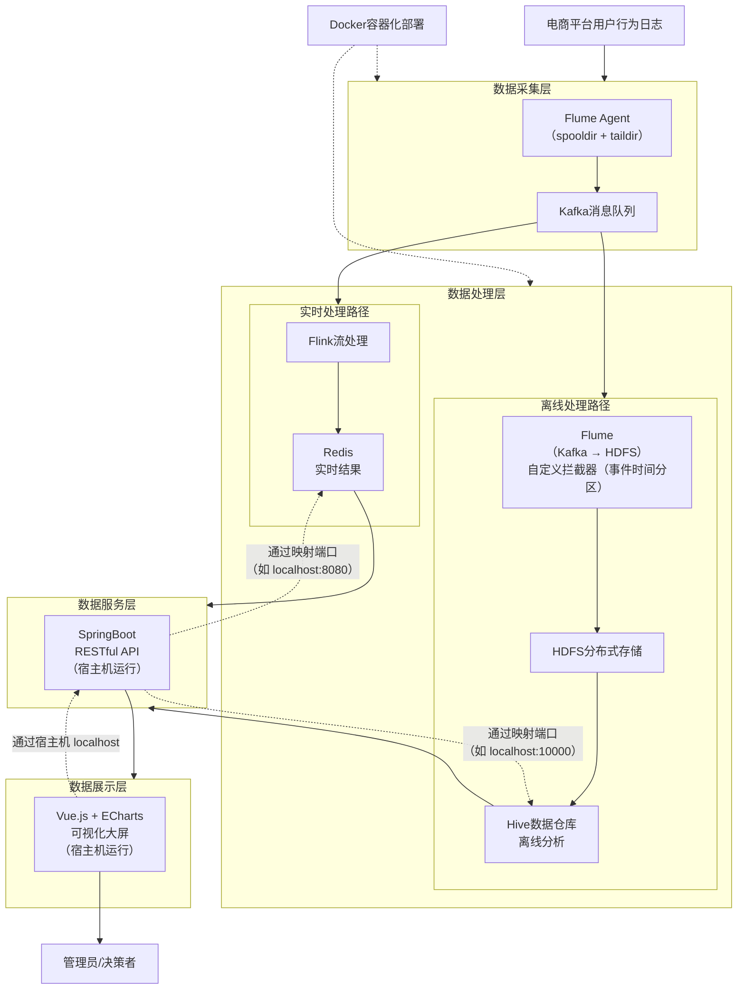

本文档仅为github项目上传以及linux环境（ubuntu）学习使用，项目完全在linux环境使用还在验证中，故而***文档还在编写中……***

### 项目原设计



### 数据获取

阿里巴巴公开数据集：[淘宝用户购物行为数据集](https://tianchi.aliyun.com/dataset/649)

离线数据集清洗

```bash

```

### 部署（编写中）

启动hadoop-hive容器，获取配置以及相关jar，后续需挂载

```bash
# 获取core-site.xml以及hdfs-site.xml 配置
docker cp namenode:/opt/hadoop-2.7.4/etc/hadoop/core-site.xml ./flume-hdfs-conf/
docker cp namenode:/opt/hadoop-2.7.4/etc/hadoop/hdfs-site.xml ./flume-hdfs-conf/

# 获取相关jar
# 复制 hadoop-common
docker cp namenode:/opt/hadoop-2.7.4/share/hadoop/common/hadoop-common-2.7.4.jar ./flume-hdfs-lib/

# 复制 hadoop-hdfs
docker cp namenode:/opt/hadoop-2.7.4/share/hadoop/hdfs/hadoop-hdfs-2.7.4.jar ./flume-hdfs-lib/

# 复制 hadoop-auth
docker cp namenode:/opt/hadoop-2.7.4/share/hadoop/common/lib/hadoop-auth-2.7.4.jar ./flume-hdfs-lib/

# 复制 commons-configuration
docker cp namenode:/opt/hadoop-2.7.4/share/hadoop/common/lib/commons-configuration-1.6.jar ./flume-hdfs-lib/

# 复制 commons-io
docker cp namenode:/opt/hadoop-2.7.4/share/hadoop/common/lib/commons-io-2.4.jar ./flume-hdfs-lib/

# 复制 htrace-core（注意文件名可能不同，用通配符）
docker cp namenode:/opt/hadoop-2.7.4/share/hadoop/common/lib/htrace-core-3.1.0-incubating.jar ./flume-hdfs-lib/

# 复制 guava
docker cp namenode:/opt/hadoop-2.7.4/share/hadoop/common/lib/guava-11.0.2.jar ./flume-hdfs-lib/
```

获取相应环境

```bash
# 更新apt
sudo apt update

# 安装java8和java17（都用到）
sudo apt install openjdk-8-jdk openjdk-17-jdk -y
# 注册 Java 8
sudo update-alternatives --install /usr/bin/java java /usr/lib/jvm/java-8-openjdk-amd64/bin/java 108
sudo update-alternatives --install /usr/bin/javac javac /usr/lib/jvm/java-8-openjdk-amd64/bin/javac 108
# 注册 Java 17
sudo update-alternatives --install /usr/bin/java java /usr/lib/jvm/java-17-openjdk-amd64/bin/java 117
sudo update-alternatives --install /usr/bin/javac javac /usr/lib/jvm/java-17-openjdk-amd64/bin/javac 117
# 切换java默认版本
sudo update-alternatives --config java
# 切换javac默认版本
sudo update-alternatives --config javac
# 确保同步JAVA_HOME环境变量
export JAVA_HOME=$(dirname $(dirname $(readlink -f $(which java))))
# 生效配置
source ~/.bashrc

# 安装git和maven
sudo apt install git maven -y
```

打包拦截器jar并放入指定目录，用于挂载

```bash
mvn -f ./flume-interceptor/pom.xml clean package

cp ./flume-interceptor/target/flume-interceptor-1.0-SNAPSHOT.jar ./flume-hdfs-lib/
```

自构建镜像my-flume-hdfs

```
docker build -t my-flume-hdfs:2.0.0 -f ./flume-custom/Dockerfile .
```

获取flink所需的jar

```bash
# 下载三个 JAR 包（使用 curl -o 指定完整保存路径）
curl -o ./flink-jars/flink-connector-kafka_2.12-1.13.6.jar https://repo1.maven.org/maven2/org/apache/flink/flink-connector-kafka_2.12/1.13.6/flink-connector-kafka_2.12-1.13.6.jar

curl -o ./flink-jars/flink-connector-redis_2.12-1.1.0.jar https://repo1.maven.org/maven2/org/apache/bahir/flink-connector-redis_2.12/1.1.0/flink-connector-redis_2.12-1.1.0.jar

curl -o ./flink-jars/kafka-clients-3.2.0.jar https://repo1.maven.org/maven2/org/apache/kafka/kafka-clients/3.2.0/kafka-clients-3.2.0.jar
```

spring boot项目analysis

```bash
# 给 mvnw 加执行权限（第一次需要）
chmod +x ./analysis/mvnw

# 开始打包（跳过测试，防止因暂时连不上 Redis/Hive 而报错）
./analysis/mvnw clean package -DskipTests

# 后台启动
nohup java -jar ./analysis/target/analysis-0.0.1-SNAPSHOT.jar > analysis.log 2>&1 &

# 查看日志
tail -f analysis.log
```

打包flink作业作业jar

```bash
mvn -f ./flink-kafka-redis/pom.xml clean package
```

vue项目frontend

```bash
cd ./frontend/
npm install
npm run build
cd -
```

nginx

```bash
# 安装验证nginx
sudo apt install nginx -y
nginx -v

# 启动nginx
sudo systemctl start nginx

# 设置nginx开机自启（这样服务器重启后不用再手动启动）
sudo systemctl enable nginx

# 查看nginx运行状态（确认是active(running)）
sudo systemctl status nginx
# 按q退出状态查看界面

# 赋权访问
# 让你的目录对nginx可读可进入（755 权限）
sudo chmod 755

# 编辑默认配置文件
sudo vim /etc/nginx/sites-available/default
```

> ```
> server {
>     listen 80 default_server;
>     root /home/ubuntu/vue-project/dist;   # <--- 指向你的 dist
>     index index.html index.htm;
>     server_name _;
>     
> 
>     # 重要：支持 Vue Router 的 history 模式，防止刷新404
>     location / {
>         try_files $uri $uri/ /index.html;
>     }
> 
> }
> ```
>
> 暂定，后续改动

### 项目部署原命令（勿用）

> [!NOTE]
>
> 以下内容仅为本地部署时所用命令，仅用于暂时记录，便于后续编写本文档

---

1. docker外部网络创建

   ```powershell
   docker network create hadoop-ecommerce-network
   ```

2. docker容器部署

   ```powershell
   cd D:\WSL\hadoop-ecommerce-analysis\docker-compose
   
   # hadoop-hive
   docker-compose -p hadoop-hive -f docker-compose-hadoop-hive.yml up -d
   
   # kafka
   docker-compose -p kafka -f docker-compose-kafka-kraft.yml up -d
   
   # redis
   docker-compose -p redis -f docker-compose-redis.yml up -d
   
   # flink
   docker-compose -p flink -f docker-compose-flink.yml up -d
   
   # flume
   docker-compose -p flume -f docker-compose-flume.yml up -d
   ```

3. 创建kafka的topic接收数据（手动创建避免出错）

   ```powershell
   docker exec -it kafka /opt/kafka/bin/kafka-topics.sh --create --topic user-behavior --bootstrap-server kafka:9092 --partitions 1 --replication-factor 1
   ```

4. 放入离线分析数据
   把对应的csv文件`UserBehavior_sampled_stratified.csv`放入监控目录`D:\WSL\hadoop-ecommerce-analysis\sampled_data`

5. 启动kafka的consumer检查数据

   ```powershell
   docker exec -it kafka /opt/kafka/bin/kafka-console-consumer.sh --bootstrap-server kafka:9092 --topic user-behavior --from-beginning
   ```

6. 访问hdfs检查数据写入

   访问hdfs的web ui：http://localhost:50070
   检查是否按照分区写入数据

7. hive离线分析

   创建外部表

   ```powershell
   docker exec hive-server beeline -u jdbc:hive2://localhost:10000 -f /opt/hive-scripts/create_external_tables.sql
   ```

   创建结果表

   ```bash
   docker exec hive-server beeline -u jdbc:hive2://localhost:10000 -f /opt/hive-scripts/create_tables.sql
   ```

   全量分析

   ```bash
   docker exec hive-server beeline -u jdbc:hive2://localhost:10000 -f /opt/hive-scripts/full_analysis.sql
   ```

   增量分析

   ```bash
   docker exec hive-server beeline -u jdbc:hive2://localhost:10000 --hivevar dt=2026-03-23 -f /opt/hive-scripts/incremental_analysis.sql
   ```

8. flink实时分析

   访问flink的web ui：http://localhost:8081
   提交新jar`flink-kafka-redis-1.0-SNAPSHOT.jar`
   选择主类 `com.ecommerce.flink.RealtimeMetricsJob`，并行度1，提交
   检查running状态

9. 模拟实时数据
   运行python脚本来模拟实时数据

   ```powershell
   cd D:\WSL\hadoop-ecommerce-analysis\scripts
   python generate_behavior.py
   ```

10. spring boot
    运行springboot项目，jdbc连接hive并创建api接口

11. vue
    cmd执行，运行前端

    ```
    cd D:\WSL\hadoop-ecommerce-analysis\frontend
    npm run dev
    ```

12. 访问web ui查看可视化成果
    访问vue的web ui：http://localhost:5173
    检查可视化成果

13. 数据丢失检查

    ```powershell
    # 检查kafka中的消息总数
    docker exec -it kafka bash
    /opt/kafka/bin/kafka-run-class.sh kafka.tools.GetOffsetShell --topic user-behavior --bootstrap-server kafka:9092 --time -1
    ```

    ```powershell
    # 进入 namenode 容器
    docker exec -it namenode bash
    # 统计所有文件的行数（注意文件名模式）
    hdfs dfs -cat /user/flume/behavior/dt=*/* 2>/dev/null | wc -l
    ```

    ```bash
    docker exec -it hive-server bash
    beeline -u jdbc:hive2://localhost:10000
    # 检查hive表行数
    SHOW PARTITIONS user_behavior;
    SELECT COUNT(*) FROM user_behavior;
    ```

14. 移除所有容器及其挂载

    ```powershell
    cd D:\WSL\hadoop-ecommerce-analysis\docker-compose
    docker-compose -p flume -f docker-compose-flume.yml down -v
    docker-compose -p flink -f docker-compose-flink.yml down -v
    docker-compose -p redis -f docker-compose-redis.yml down -v
    docker-compose -p kafka -f docker-compose-kafka-kraft.yml down -v
    docker-compose -p hadoop-hive -f docker-compose-hadoop-hive.yml down -v
    ```

    


